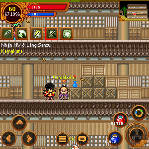
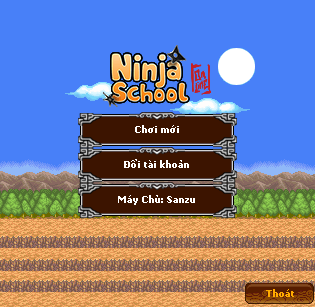
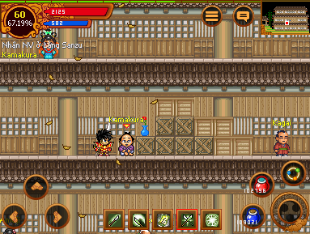

# <div align="center"></div>

<div align="center">

**The Modern, High-Performance Java ME Emulator**

*Fast, Isolated , and lightweight J2ME environment for desktop platforms, built with Java Swing and custom native integrations.*

[](https://github.com/nsomatrix/neutron/releases)
[](https://github.com/nsomatrix/neutron/actions)
[](https://github.com/nsomatrix/neutron/blob/main/neutron/COPYING-LGPL-2.1)
[](https://adoptium.net/)

[Documentation](https://neutron-emu.vercel.app/docs) • [Releases](https://github.com/nsomatrix/neutron/releases) • [Quick Start](https://neutron-emu.vercel.app/docs/getting-started/quick-start) • [Report Bug](https://github.com/nsomatrix/neutron/issues)

</div>

---

## 📸 Screenshots

<div align="center">
  <table border="0">
    <tr>
      <td>
        
      </td>
      <td>
        
      </td>
    </tr>
    <tr>
      <td>
        
      </td>
      <td>
        
      </td>
    </tr>
  </table>
</div>

---

## ✨ Features

Neutron is designed for retro-gaming enthusiasts, preservationists, and mobile app developers. It delivers a modern developer experience and polished UI alongside high-compatibility emulation.

### ⚙️ Core Runtime Engine
* **CLDC 1.1 Compliance:** Complete implementation of the Connected Limited Device Configuration standard (`java.lang`, `java.util`, `java.io`, floating-point arithmetic, thread scheduler, and Generic Connection Framework).
* **MIDP 2.0 Compliance:** Fully supports LCDUI components (Forms, Lists, TextBoxes, Alerts, Canvas) and J2ME Game API (GameCanvas, Sprites, TiledLayers, LayerManager).
* **Configurable Heap Memory:** Customize virtual machine heap sizes dynamically from 32MB up to 512MB, backed by a real-time Garbage Collection (GC) monitor.
* **Smart Sleep Mode (`Ctrl+L`):** Automatically throttles background emulator worker threads when idle, lowering host CPU footprint.

### 🎮 Execution & File Management
* **Flexible Loading:** Execute `.jar` and `.jad` files directly. Local directories are scanned in bulk and cached.
* **Remote Execution:** Launch online MIDlets directly from remote HTTP/HTTPS endpoints by pasting the URL.
* **Integrated Library Explorer:** Graphical dashboard cataloging scanned apps with versions, developer details, and application icons.
* **Snapshot Manager:** Export/import your database files (RMS) and configurations into standard `.zip` files to clone your emulator state.

### 📺 High-Fidelity Graphics & Video Settings
* **Dynamic Resolution Presets:** Quick scale configurations from retro 128×160 to high-res 480×800.
* **Advanced Scaling & Filters:** Features Bilinear/Bicubic smoothing, pixel-art enhancement (Scale2x), CRT Scanlines, and simulated LCD screen grids.
* **Hardware Adjustments:** Tweak Brightness, Contrast, Gamma, Saturation, Sharpness, Ghosting, and Color Inversion on the fly.
* **Immersive Fullscreen Mode (`F11`):** Borderless fullscreen with an auto-hiding menu bar and HUD notifications.
* **Modern Themes:** Out-of-the-box support for theme-aware dynamic skins using FlatLaf templates (Dark, Light, Darcula, System).

### ⌨️ Input & Audio Emulation
* **Custom Keymaps:** Full layout configuration to map physical keys to mobile numeric keypads, D-Pads, and Soft Keys.
* **Controller Support:** Connect USB/Bluetooth gamepads to control games with native analog sticks and buttons.
* **Stylus & Touch Emulation:** Simulates touch clicks via mouse interaction with live coordinate tracking overlays.
* **High-Fidelity Audio:** Reproduces classic mobile audio including PCM WAV/AU files, MIDI synthesis, and frequency-based tone commands.

### 🌐 Networking & Developer Diagnostics
* **Global Network Switch:** Master toggle ("Allow Network") to cut off or grant J2ME internet permissions instantly.
* **Proxy Support:** Route GCF network traffic through HTTP, SOCKS4, or SOCKS5 proxies, including full credential authentication.
* **Diagnostics Dashboard:** Floating HUD with real-time FPS/heap indicators, live developer logging console, RMS Record Store explorer, screenshot captures (`Ctrl+S`), and GIF screen recorder.

---

## 🚀 Getting Started

### Prerequisites

| Component | Minimum Requirement | Recommended |
|-----------|---------------------|-------------|
| **OS** | Windows 10, macOS 11, Ubuntu 20.04 | Latest stable release |
| **CPU** | Any x86_64 or ARM64 | Multi-core CPU |
| **Memory** | 256 MB RAM | 512 MB RAM |
| **Java** | JDK 11+ | JDK 17+ (e.g., [Eclipse Temurin](https://adoptium.net/)) |

> [!IMPORTANT]
> Neutron requires a full Java Development Kit (JDK) to compile and run preverification tasks. A Java Runtime Environment (JRE) alone is not sufficient. Ensure `javac` is available in your shell path:
> ```bash
> javac -version
> ```

---

## 📦 Installation & Setup

### Platform-Specific Packages

Download the packaged bundles from the [GitHub Releases](https://github.com/nsomatrix/neutron/releases) page:

* **Windows:** Download the `.exe` installer and run the wizard.
* **macOS:** Download the `.dmg` file, open the disk image, and drag Neutron to your `/Applications` folder. Right-click and choose "Open" on first launch to bypass Gatekeeper.
* **Linux:** Extract the tarball and run the executable:
  ```bash
  tar -xzf neutron-linux-x64.tar.gz
  cd neutron
  ./neutron
  ```

### Universal JAR Execution

Alternatively, you can run the emulator on any Java-enabled system via the universal executable:

```bash
# Download the release jar
curl -LO https://github.com/nsomatrix/neutron/releases/latest/download/neutron.jar

# Run the GUI
java -jar neutron.jar
```

---

## 🕹️ Controls (Default Keymap)

| Physical Key | Mobile Device Button |
|:---|:---|
| **Arrow Keys** | Directional Pad (Up/Down/Left/Right) |
| **Enter** | Fire / Select |
| **Q** | Left Soft Key |
| **W** | Right Soft Key |
| **0 - 9** | Numeric Keypad |
| **\*** | Asterisk Key |
| **#** | Pound Key |
| **F11** | Fullscreen Toggle |
| **Ctrl + L** | Throttle/Sleep Mode |
| **Ctrl + S** | Save Screenshot |

*Controls can be fully remapped via **Config → Controls** in the menu bar.*

---

## 🛠️ Command Line Interface (CLI)

Neutron features a robust CLI for scripting, automation, and quick launching.

```bash
# Run a local game directly
neutron run game.jar

# Run with customized resolution and scale
neutron run game.jar --width 240 --height 320 --scale 3

# Launch in fullscreen, locking execution to 60 FPS
neutron run game.jar --fullscreen --fps 60

# Run a remote game by URL, disabling internet permissions
neutron run http://example.com/games/snake.jad --no-network

# List all MIDlets packaged inside a JAR
neutron list game.jar

# Read metadata and manifest details of a JAR
neutron info game.jar

# Modify emulator configuration
neutron config set display.scale 3
```

---

## ⚙️ Configuration System (`config.toml`)

Neutron stores preferences in a TOML config file located at:
* **Windows:** `%APPDATA%\Neutron\config.toml`
* **macOS:** `~/Library/Application Support/Neutron/config.toml`
* **Linux:** `~/.config/neutron/config.toml`

### Example Configuration

```toml
[display]
width = 240
height = 320
scale = 2
scaling_mode = "nearest"  # "nearest" or "bilinear"
fullscreen = false
vsync = true
fps_limit = 60

[audio]
enabled = true
volume = 80
sample_rate = 44100
buffer_size = 1024

[input]
keyboard_enabled = true
gamepad_enabled = false

[network]
allow_network = true
proxy_enabled = false
proxy_host = "127.0.0.1"
proxy_port = 1080
proxy_type = "socks5"     # "http", "socks4", or "socks5"

[ui]
theme = "dark"            # "dark" or "light"
show_fps = false
show_status_bar = true
```

---

## 🏗️ Building From Source

### 1. Install System Audio Dependencies (Linux Only)
To compile audio features, Linux developers must install ALSA header files:

* **Debian/Ubuntu:** `sudo apt install libasound2-dev`
* **Fedora/RHEL:** `sudo dnf install alsa-lib-devel`
* **Arch Linux:** `sudo pacman -S alsa-lib`

### 2. Clone and Build
Build the project using the included Gradle wrapper from the root directory:

```bash
# Clone the repository
git clone https://github.com/nsomatrix/neutron.git
cd neutron

# Build all modules and run tests
./gradlew build

# Fast build (skipping unit tests)
./gradlew build -x test
```

### 3. Run the Compiled Project
To start the emulator GUI directly from source:
```bash
./gradlew run
```

To run and pass arguments (e.g. running a specific game):
```bash
./gradlew run --args="run path/to/game.jar"
```

The compiled standalone executable JAR is generated at:
📂 `neutron/neutron-javase-swing/build/libs/neutron-javase-swing-1.0.jar`

Run it using Java:
```bash
java -jar neutron/neutron-javase-swing/build/libs/neutron-javase-swing-1.0.jar
```

---

## 📂 Project Structure

Neutron is organized into separate modules to keep the core emulator logic decoupled from frontend interfaces.

```
neutron/
├── api/                       # Shared interfaces and core API definitions
├── neutron/                   # Main project module containing license, credits, and tooling
├── neutron-cldc/              # CLDC 1.1 virtual machine and standard libraries
├── neutron-midp/              # J2ME MIDP 2.0 API implementation and standard GUI components
├── neutron-javase/            # Standard Java SE desktop wrappers and device profiles
├── neutron-javase-swing/      # Main Swing-based GUI desktop emulator (desktop launcher)
├── neutron-javase-swt/        # Alternative SWT-based desktop emulator
├── neutron-javase-applet/     # Legacy web applet container
├── neutron-android/           # Android app port (experimental)
├── neutron-iphone/            # iPhone app port (experimental)
├── neutron-extensions/        # Device profiles, skin libraries, and extra extensions
└── neutron-emu/               # Next.js web application for documentation (https://neutron-emu.vercel.app)
```

---

## 💻 IDE Integration & Development

* **IntelliJ IDEA (Recommended):** Open the project, select the root `build.gradle` file, and choose "Open as Project". IntelliJ will sync dependencies and prepare launcher run configurations.
* **VS Code:** Install the **Extension Pack for Java**. Open the workspace root. The Java Language Server will auto-detect the Gradle wrapper.
* **Continuous Development Mode:** During active coding sessions, use the continuous build flag to auto-recompile modifications:
  ```bash
  ./gradlew -t build
  ```

---

## 🤝 Contributing

Contributions to Neutron are always welcome! Feel free to review the issue tracker to report bugs, suggest features, or submit pull requests.

1. Fork the repository
2. Create your feature branch (`git checkout -b feature/AmazingFeature`)
3. Commit your changes (`git commit -m 'Add some AmazingFeature'`)
4. Push to the branch (`git push origin feature/AmazingFeature`)
5. Open a Pull Request

---

## 📄 License

Neutron is open source licensed under the **LGPL-2.1 License**. Please see the [COPYING-LGPL-2.1](neutron/COPYING-LGPL-2.1) file in the source repository for the full license text.
