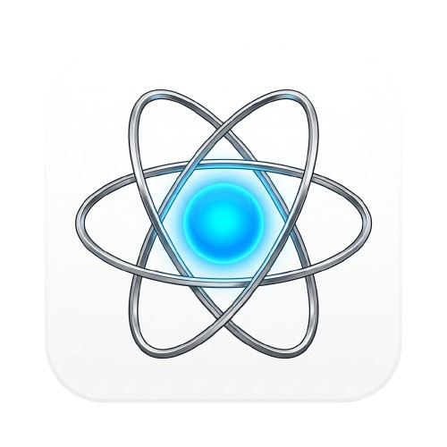

<p align="center">
  
</p>

# Neutron

**Neutron** is a J2ME (Java 2 Micro Edition) device emulator framework written in Java, paired with a modern web interface. It enables running MIDP/CLDC applications across Java SE environments, browser applets, desktop applications, and web interfaces.

---

## 🚀 Features

- **J2ME MIDP/CLDC Emulator**: Emulate MIDlets in a pure Java SE environment.
- **Extension & API Support**: Support for Nokia UI, Siemens API, and various JSR extensions (JSR-75, JSR-82, JSR-120, JSR-135).
- **Multiple Target Environments**:
  - Standalone Desktop Java Application (Swing / SWT)
  - Java Applet & WebStart support
  - Android integration support
- **Web UI (`neutron-emu`)**: Modern Next.js interface for managing and running emulator sessions.

---

## 📁 Repository Structure

```text
neutron/
├── neutron/              # Core Java J2ME emulator modules, APIs, and extensions
├── neutron-emu/          # Next.js web dashboard and frontend interface
├── build.gradle          # Gradle root build configuration
├── settings.gradle       # Gradle subproject definitions
└── gradlew               # Gradle wrapper script
```

---

## 🛠️ Getting Started

### Prerequisites

- **Java**: JDK 8+ (or JDK 17+ recommended)
- **Node.js**: v18+ & `npm` (for `neutron-emu` web UI)

### 1. Building the Java Core

Use the Gradle wrapper to build the Java modules:

```bash
# Build all Java subprojects
./gradlew build
```

### 2. Running the Web UI (`neutron-emu`)

Navigate into the web app directory and start the dev server:

```bash
cd neutron-emu
npm install
npm run dev
```

Open [http://localhost:3000](http://localhost:3000) in your browser to access the web frontend.

---

## 📜 License

This project is open-source. See the `COPYING` files in the `neutron/` directory for individual module licensing details.
